# LicenseGuard Platform - System Architecture

**Version:** 1.0.0
**Last Updated:** 2026-01-25
**Status:** Production Ready

---

## Table of Contents

1. [System Overview](#system-overview)
2. [Architecture Layers](#architecture-layers)
3. [Frontend Layer](#frontend-layer)
4. [API Gateway](#api-gateway)
5. [Backend Services](#backend-services)
6. [Shared Packages](#shared-packages)
7. [Data Layer](#data-layer)
8. [Infrastructure](#infrastructure)
9. [Communication Patterns](#communication-patterns)
10. [Deployment Architecture](#deployment-architecture)

---

## System Overview

LicenseGuard is a modern multi-tenant SaaS platform built with a **microservices architecture**. The system is organized into logical layers with clear separation of concerns:

- **Frontend Layer**: React-based admin interfaces
- **API Gateway**: Traefik reverse proxy with domain-based routing
- **Backend Services**: 6 independent microservices (Node.js/Express)
- **Shared Packages**: 4 npm packages for code reuse
- **Data Layer**: PostgreSQL database with Redis caching
- **Infrastructure**: Docker-based containerized deployment

### High-Level Architecture

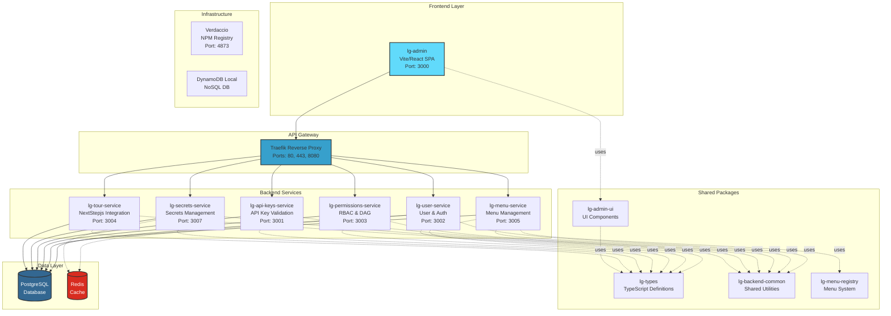

---

## Architecture Layers

### Layered Architecture Overview

```mermaid
graph TB
    subgraph "Presentation Layer"
        UI[React UI Components]
    end

    subgraph "Application Layer"
        Gateway[API Gateway - Traefik]
    end

    subgraph "Business Logic Layer"
        Services[Microservices<br/>User | Menu | Permissions | API Keys | Secrets | Tour]
    end

    subgraph "Data Access Layer"
        ORM[Data Models & Repositories]
    end

    subgraph "Data Storage Layer"
        DB[(PostgreSQL + Redis)]
    end

    UI --> Gateway
    Gateway --> Services
    Services --> ORM
    ORM --> DB

    style UI fill:#61dafb
    style Gateway fill:#37a0cc
    style Services fill:#68a063
    style ORM fill:#f1e05a
    style DB fill:#336791,color:#fff
```

### Layer Responsibilities

| Layer | Responsibility | Technologies |
|-------|----------------|--------------|
| **Presentation** | User interface, user interactions | React, Vite, lg-admin-ui |
| **Application** | Request routing, load balancing, SSL termination | Traefik |
| **Business Logic** | Core business rules, service logic | Node.js, Express, TypeScript |
| **Data Access** | Database queries, ORM, caching | Knex.js, PostgreSQL, Redis |
| **Data Storage** | Persistent data storage | PostgreSQL 16, Redis |

---

## Frontend Layer

### Admin UI (lg-admin)

**Technology Stack:**
- React 18
- Vite (build tool)
- TypeScript
- lg-admin-ui (shared components)

**Key Features:**
- Single Page Application (SPA)
- Server-Side Routing via Traefik
- JWT-based authentication
- Role-based UI rendering

**Access:**
- Development: `http://admin.lg.local`
- Production: `https://admin.licenseguard.com`

**Component Architecture:**

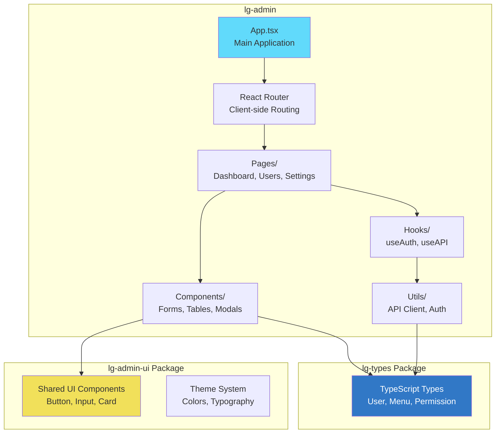

---

## API Gateway

### Traefik Reverse Proxy

**Role:** Centralized entry point for all HTTP requests

**Key Features:**
- Domain-based routing (admin.lg.local, api.lg.local)
- Automatic HTTPS with Let's Encrypt
- Load balancing (round-robin)
- Health checks
- Request/response middleware
- Access logs

### Routing Configuration

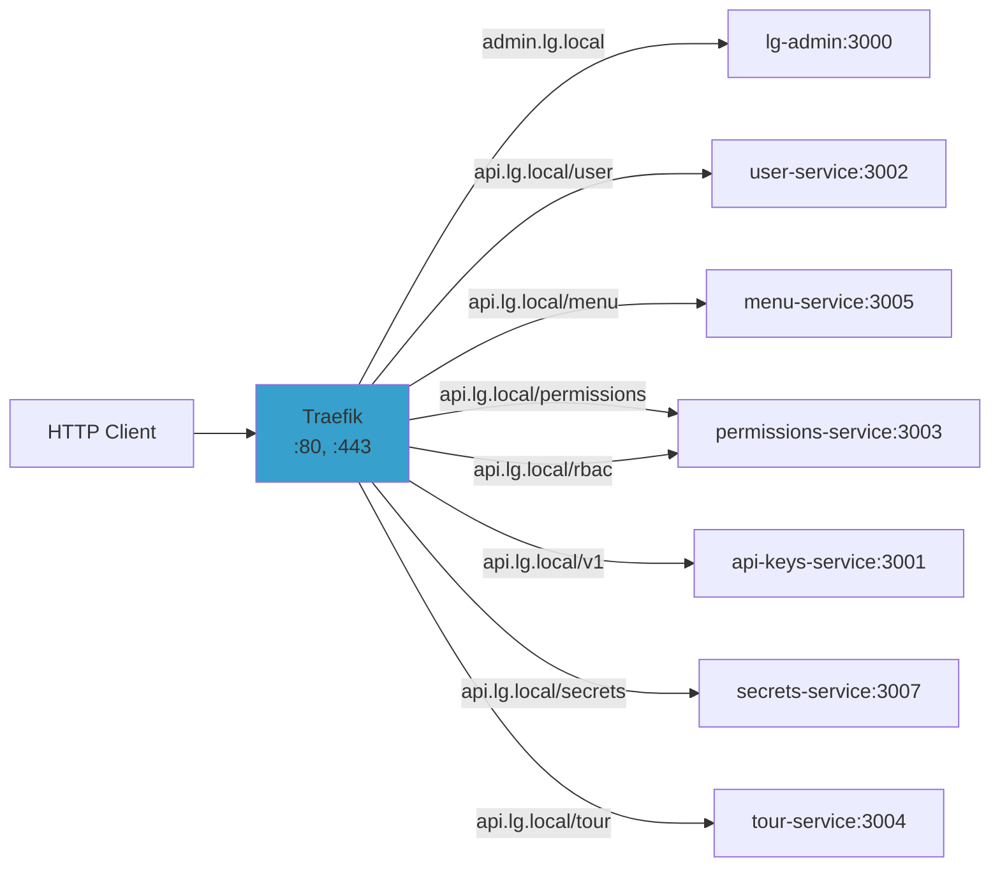

### Routing Rules

| Domain Pattern | Target Service | Port | Path Prefix |
|----------------|----------------|------|-------------|
| `admin.lg.local` | lg-admin | 3000 | / |
| `api.lg.local/user` | lg-user-service | 3002 | /user |
| `api.lg.local/menu` | lg-menu-service | 3005 | /menu |
| `api.lg.local/permissions` | lg-permissions-service | 3003 | /permissions |
| `api.lg.local/rbac` | lg-permissions-service | 3003 | /rbac |
| `api.lg.local/v1` | lg-api-keys-service | 3001 | /v1 |
| `api.lg.local/secrets` | lg-secrets-service | 3007 | /secrets |
| `api.lg.local/tour` | lg-tour-service | 3004 | /tour |
| `traefik.lg.local` | Traefik Dashboard | 8080 | / |

---

## Backend Services

### Service Overview

| Service | Purpose | Port | Database | Dependencies |
|---------|---------|------|----------|--------------|
| **lg-user-service** | User management, authentication | 3002 | PostgreSQL | backend-common, types |
| **lg-menu-service** | Hierarchical menu management | 3005 | PostgreSQL | menu-registry, backend-common, types |
| **lg-permissions-service** | RBAC & DAG permissions | 3003 | PostgreSQL | backend-common, types |
| **lg-api-keys-service** | Public API key validation | 3001 | PostgreSQL | backend-common, types |
| **lg-secrets-service** | Encrypted secrets storage | 3007 | PostgreSQL, Redis | backend-common, types |
| **lg-tour-service** | NextStepjs integration | 3004 | PostgreSQL | backend-common, types |

### Service Architecture Pattern

All backend services follow a consistent architecture:

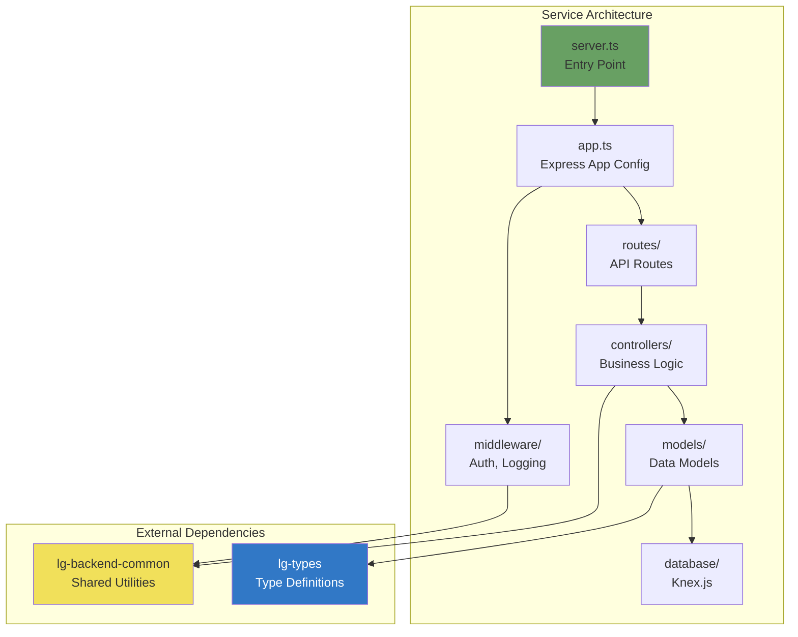

### Service Responsibilities

#### lg-user-service
- User registration and authentication
- JWT token generation and validation
- Password hashing (bcrypt)
- User profile management
- Session management

#### lg-menu-service
- Hierarchical menu CRUD operations
- Menu item ordering
- Permission-based menu filtering
- Menu cache management

#### lg-permissions-service
- Role-based access control (RBAC)
- Directed Acyclic Graph (DAG) permissions
- Permission inheritance
- Role assignment and revocation

#### lg-api-keys-service
- Public API key generation
- API key validation
- Rate limiting
- Usage tracking

#### lg-secrets-service
- Encrypted secret storage
- AES-256 encryption
- Secret versioning
- Access audit logging

#### lg-tour-service
- NextStepjs integration
- Guided tour management
- User progress tracking
- Tour analytics

---

## Shared Packages

### Package Dependency Graph

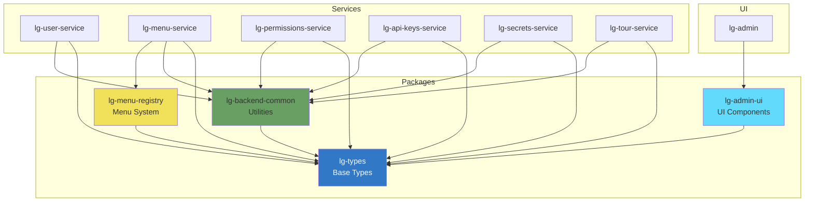

### Package Descriptions

#### lg-types
**Purpose:** Shared TypeScript type definitions

**Exports:**
- User types (User, UserRole, UserSession)
- Menu types (MenuItem, MenuPermission)
- Permission types (Permission, Role, RolePermission)
- API types (APIKey, APIResponse)
- Secret types (Secret, SecretVersion)

**Dependents:** All services + UI

#### lg-backend-common
**Purpose:** Shared backend utilities and middleware

**Exports:**
- Authentication middleware (JWT validation)
- Logging utilities (Winston)
- Error handling middleware
- Database helpers (Knex utilities)
- Validation helpers (Joi schemas)

**Dependents:** All backend services

#### lg-menu-registry
**Purpose:** Menu system configuration and types

**Exports:**
- Menu definitions
- Menu item schemas
- Menu permissions mapping
- Menu validation

**Dependents:** lg-menu-service, potentially lg-admin

#### lg-admin-ui
**Purpose:** Shared React UI components

**Exports:**
- Button, Input, Select components
- Form components
- Table components
- Modal, Dialog components
- Theme provider

**Dependents:** lg-admin

---

## Data Layer

### Database Schema Overview

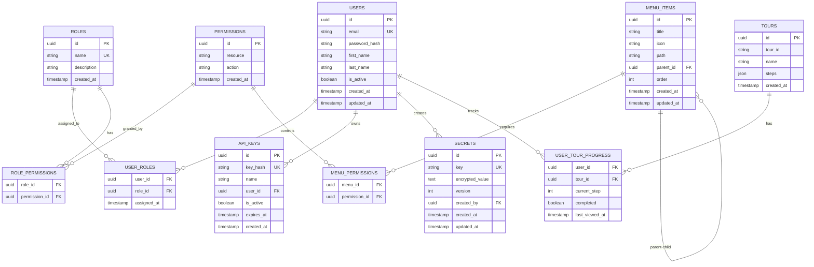

### Database Technologies

| Component | Technology | Version | Purpose |
|-----------|-----------|---------|---------|
| **Primary Database** | PostgreSQL | 16 | Relational data storage |
| **Query Builder** | Knex.js | 3.x | SQL query construction |
| **Migrations** | Knex Migrations | - | Schema versioning |
| **Cache** | Redis | 7 | Session storage, caching |

---

## Infrastructure

### Infrastructure Components

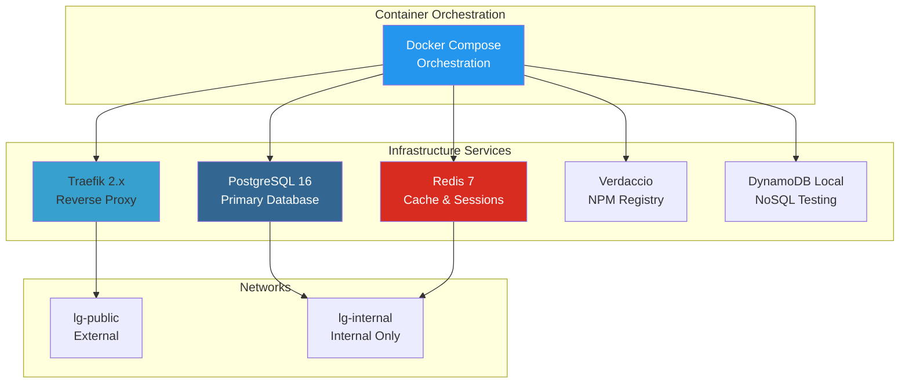

### Network Architecture

| Network | Type | Purpose | Connected Services |
|---------|------|---------|-------------------|
| **lg-public** | Bridge | External access | Traefik, Frontend |
| **lg-internal** | Bridge | Service communication | All backend services, databases |

---

## Communication Patterns

### Service-to-Service Communication

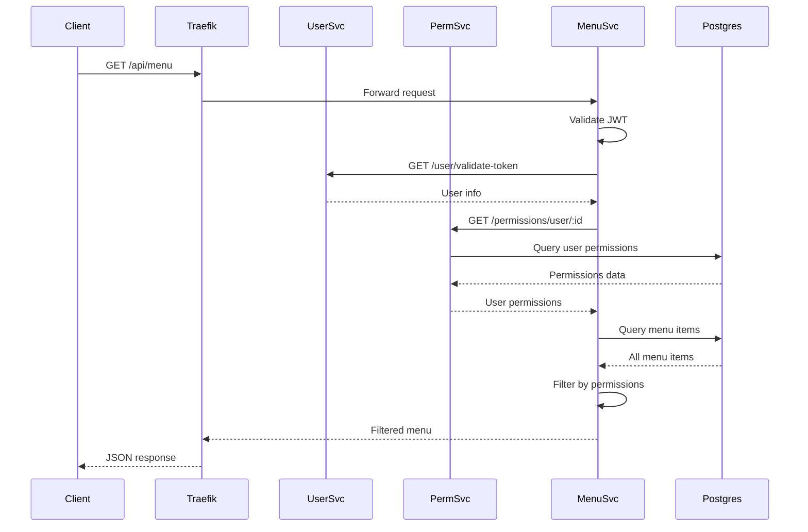

### Authentication Flow

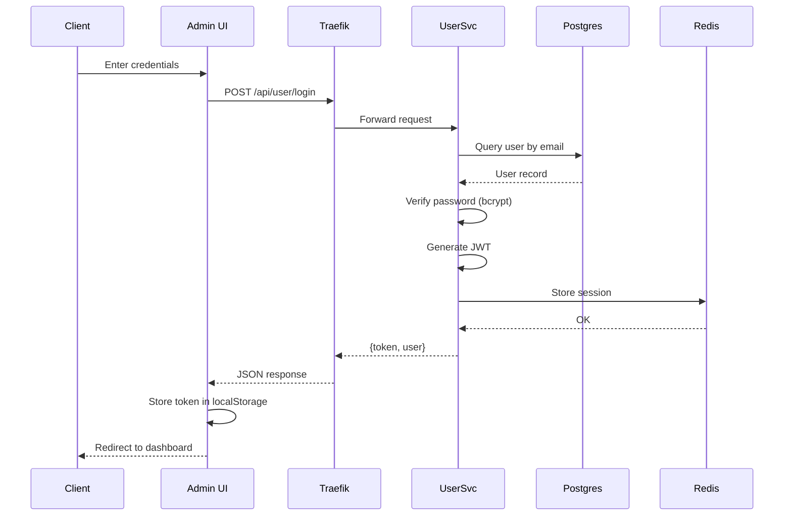

---

## Deployment Architecture

### Development Environment

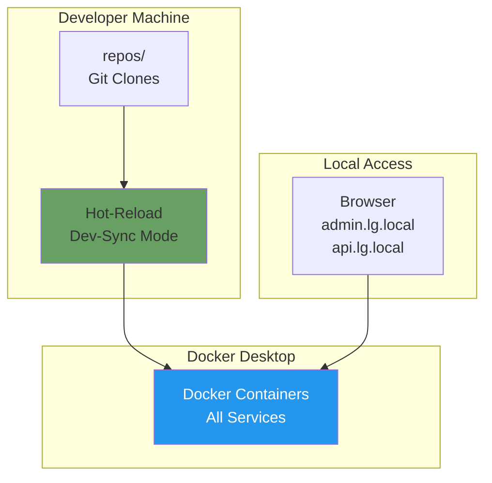

### Production Environment (Future)

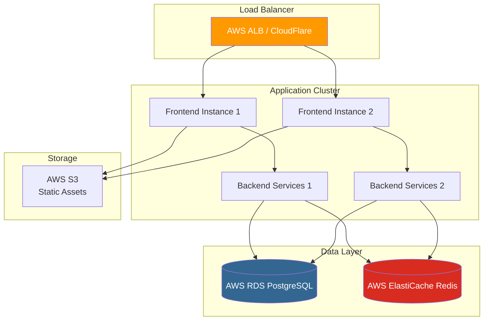

---

## Performance Considerations

### Caching Strategy

| Layer | Cache Type | TTL | Use Case |
|-------|-----------|-----|----------|
| **API Gateway** | HTTP Cache | 60s | Static assets |
| **Application** | Redis | 300s | User sessions |
| **Database** | Query Cache | 60s | Frequently accessed data |
| **CDN** | Edge Cache | 3600s | Public assets |

### Scalability

**Horizontal Scaling:**
- All services are stateless (except database)
- Can scale by adding more container instances
- Load balancing via Traefik

**Vertical Scaling:**
- Database can scale to higher-tier instances
- Redis can use clustered mode

---

## Security Architecture

### Security Layers

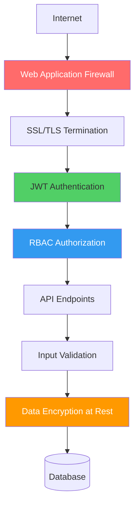

### Security Features

| Feature | Implementation | Layer |
|---------|---------------|-------|
| **Authentication** | JWT tokens (RS256) | Application |
| **Authorization** | RBAC + DAG permissions | Application |
| **Encryption in Transit** | TLS 1.3 | Gateway |
| **Encryption at Rest** | AES-256 (secrets) | Application |
| **SQL Injection Protection** | Parameterized queries (Knex.js) | Data Access |
| **XSS Protection** | Content Security Policy | Frontend |
| **CSRF Protection** | SameSite cookies | Frontend |
| **Rate Limiting** | API key throttling | API Gateway |

---

## Monitoring & Observability

### Logging

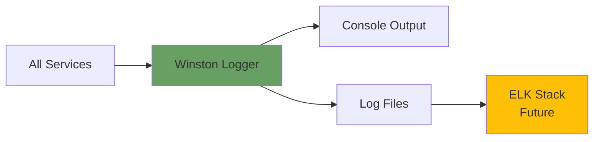

### Health Checks

All services expose:
- `GET /health` - Basic health check
- `GET /metrics` - Prometheus metrics (future)

---

## Directory Structure

See [Project Root README](../README.md) for complete directory structure.

```
repos/
├── services/          # Backend microservices (6 services)
├── packages/          # Shared npm packages (4 packages)
├── ui/                # Frontend applications (1 app)
└── infrastructure/    # Infrastructure components (5 components)
```

---

## Related Documentation

- **[DEPENDENCIES.md](./DEPENDENCIES.md)** - Package dependency graph and version management
- **[DOCKER.md](./DOCKER.md)** - Docker architecture and best practices
- **[TESTING.md](./TESTING.md)** - Testing strategy and guidelines
- **[RBAC.md](./RBAC.md)** - RBAC and DAG permissions implementation
- **Service Documentation:**
  - [lg-user-service/ARCHITECTURE.md](../repos/services/lg-user-service/ARCHITECTURE.md)
  - [lg-menu-service/ARCHITECTURE.md](../repos/services/lg-menu-service/ARCHITECTURE.md)
  - [lg-permissions-service/ARCHITECTURE.md](../repos/services/lg-permissions-service/ARCHITECTURE.md)
  - [lg-api-keys-service/ARCHITECTURE.md](../repos/services/lg-api-keys-service/ARCHITECTURE.md)
  - [lg-secrets-service/ARCHITECTURE.md](../repos/services/lg-secrets-service/ARCHITECTURE.md)
  - [lg-tour-service/ARCHITECTURE.md](../repos/services/lg-tour-service/ARCHITECTURE.md)

---

## Glossary

| Term | Definition |
|------|------------|
| **DAG** | Directed Acyclic Graph - Permission inheritance structure |
| **JWT** | JSON Web Token - Authentication token format |
| **RBAC** | Role-Based Access Control - Permission model |
| **SPA** | Single Page Application - Client-side rendered web app |
| **TTL** | Time To Live - Cache expiration time |

---

**Next Steps:**
1. Review service-specific ARCHITECTURE.md files for detailed implementation
2. Check DEPENDENCIES.md for package dependency graph
3. See DOCKER.md for local development setup
