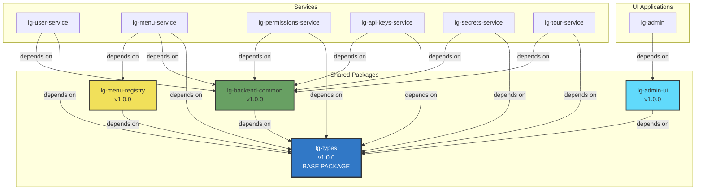
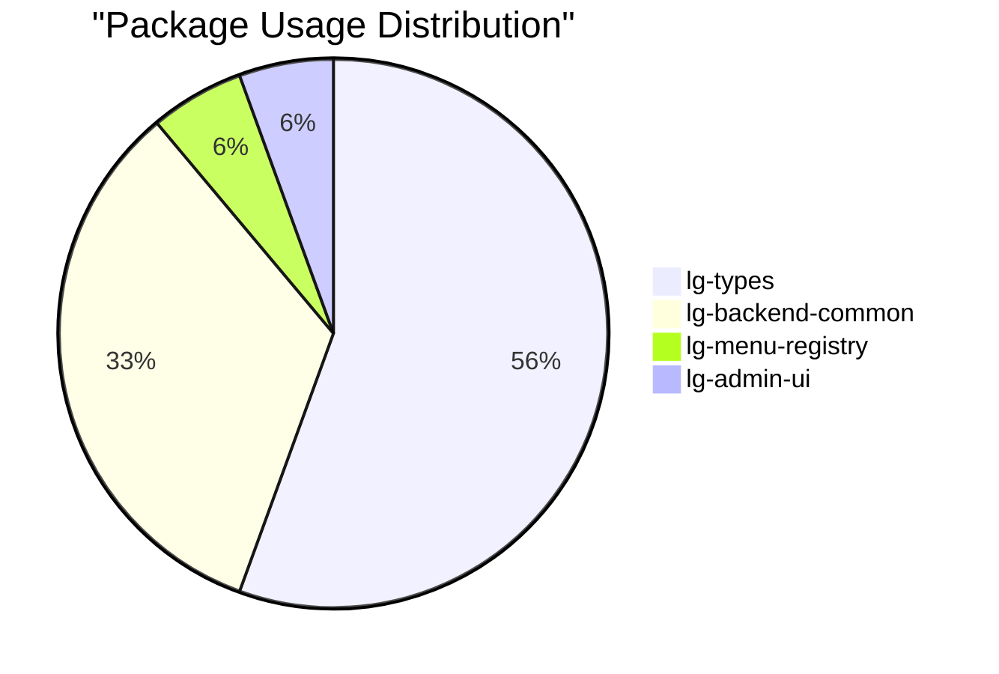
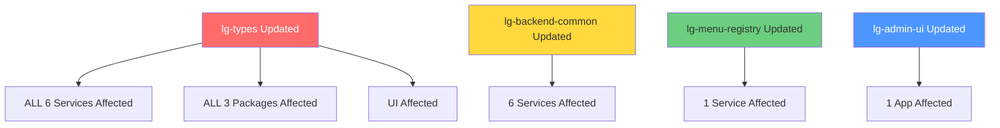

# LicenseGuard Platform - Package Dependencies

**Version:** 1.0.0
**Last Updated:** 2026-01-25

---

## Table of Contents

1. [Overview](#overview)
2. [Package Dependency Graph](#package-dependency-graph)
3. [Package Details](#package-details)
4. [Version Matrix](#version-matrix)
5. [Dependency Rules](#dependency-rules)
6. [Circular Dependency Detection](#circular-dependency-detection)
7. [Update Strategy](#update-strategy)

---

## Overview

The LicenseGuard platform uses **4 shared npm packages** to promote code reuse and maintain consistency across services:

- **lg-types** - TypeScript type definitions (base dependency for all)
- **lg-backend-common** - Shared backend utilities and middleware
- **lg-menu-registry** - Menu system configuration and types
- **lg-admin-ui** - Shared React UI components

**Total Dependents:** 7 projects (6 backend services + 1 frontend app)

---

## Package Dependency Graph

### Full Dependency Tree



### Dependency Levels

**Level 0 (Base):**
- `lg-types` - No dependencies

**Level 1:**
- `lg-backend-common` → depends on `lg-types`
- `lg-menu-registry` → depends on `lg-types`
- `lg-admin-ui` → depends on `lg-types`

**Level 2 (Consumers):**
- All 6 backend services → depend on packages from Level 0 & 1
- `lg-admin` → depends on `lg-admin-ui` (Level 1)

---

## Package Details

### lg-types

**Purpose:** Shared TypeScript type definitions for the entire platform

**Package Info:**
- **Name:** `@wolfgangm81/lg-types`
- **Version:** 1.0.0
- **Type:** Library (npm package)
- **License:** MIT

**Exports:**
```typescript
// User types
export interface User { ... }
export interface UserRole { ... }
export interface UserSession { ... }

// Menu types
export interface MenuItem { ... }
export interface MenuPermission { ... }

// Permission types
export interface Permission { ... }
export interface Role { ... }

// API types
export interface APIKey { ... }
export interface APIResponse<T> { ... }

// Secret types
export interface Secret { ... }
export interface SecretVersion { ... }
```

**Dependents:** ALL (6 services + 3 packages + 1 UI)

**Impact of Changes:** HIGH - Affects all projects

---

### lg-backend-common

**Purpose:** Shared backend utilities, middleware, and helpers

**Package Info:**
- **Name:** `@wolfgangm81/lg-backend-common`
- **Version:** 1.0.0
- **Type:** Library (npm package)
- **License:** MIT

**Exports:**
```typescript
// Middleware
export { authMiddleware } from './middleware/auth';
export { errorHandler } from './middleware/error';
export { requestLogger } from './middleware/logger';

// Utilities
export { hashPassword, comparePassword } from './utils/password';
export { generateJWT, verifyJWT } from './utils/jwt';
export { validate } from './utils/validation';

// Database helpers
export { createConnection } from './database/connection';
export { runMigrations } from './database/migrations';
```

**Dependencies:**
- `lg-types` (peer dependency)
- `express` (peer dependency)
- `winston` (logging)
- `joi` (validation)
- `bcrypt` (password hashing)

**Dependents:** 6 backend services

**Impact of Changes:** HIGH - Affects all backend services

---

### lg-menu-registry

**Purpose:** Menu system configuration and validation

**Package Info:**
- **Name:** `@wolfgangm81/lg-menu-registry`
- **Version:** 1.0.0
- **Type:** Library (npm package)
- **License:** MIT

**Exports:**
```typescript
// Menu definitions
export { defaultMenuItems } from './menus/default';
export { adminMenuItems } from './menus/admin';

// Menu schemas
export { menuItemSchema } from './schemas/menu-item';

// Menu utilities
export { validateMenu } from './utils/validation';
export { sortMenuItems } from './utils/sort';
```

**Dependencies:**
- `lg-types` (peer dependency)

**Dependents:** 1 service (lg-menu-service)

**Impact of Changes:** LOW - Only affects menu service

---

### lg-admin-ui

**Purpose:** Shared React UI components for admin interfaces

**Package Info:**
- **Name:** `@wolfgangm81/lg-admin-ui`
- **Version:** 1.0.0
- **Type:** Library (npm package)
- **License:** MIT

**Exports:**
```typescript
// Components
export { Button } from './components/Button';
export { Input } from './components/Input';
export { Select } from './components/Select';
export { Table } from './components/Table';
export { Modal } from './components/Modal';
export { Card } from './components/Card';

// Theme
export { ThemeProvider } from './theme/ThemeProvider';
export { useTheme } from './theme/useTheme';
```

**Dependencies:**
- `lg-types` (peer dependency)
- `react` (peer dependency)
- `react-dom` (peer dependency)

**Dependents:** 1 UI app (lg-admin)

**Impact of Changes:** LOW - Only affects admin UI

---

## Version Matrix

### Current Versions (2026-01-25)

| Package | Version | Published | Registry |
|---------|---------|-----------|----------|
| lg-types | 1.0.0 | 2026-01-24 | GitHub Packages |
| lg-backend-common | 1.0.0 | 2026-01-24 | GitHub Packages |
| lg-menu-registry | 1.0.0 | 2026-01-24 | GitHub Packages |
| lg-admin-ui | 1.0.0 | 2026-01-24 | GitHub Packages |

### Service Version Requirements

| Service | lg-types | lg-backend-common | lg-menu-registry | lg-admin-ui |
|---------|----------|-------------------|------------------|-------------|
| lg-user-service | ^1.0.0 | ^1.0.0 | - | - |
| lg-menu-service | ^1.0.0 | ^1.0.0 | ^1.0.0 | - |
| lg-permissions-service | ^1.0.0 | ^1.0.0 | - | - |
| lg-api-keys-service | ^1.0.0 | ^1.0.0 | - | - |
| lg-secrets-service | ^1.0.0 | ^1.0.0 | - | - |
| lg-tour-service | ^1.0.0 | ^1.0.0 | - | - |
| lg-admin | ^1.0.0 | - | - | ^1.0.0 |

### Dependency Count by Package



---

## Dependency Rules

### 1. No Circular Dependencies

**Rule:** Packages MUST NOT depend on each other in a circular manner.

**Valid:**
```
lg-types → (no deps)
lg-backend-common → lg-types ✅
```

**Invalid:**
```
lg-backend-common → lg-types
lg-types → lg-backend-common ❌
```

**Enforcement:** Pre-publish validation script

---

### 2. Semantic Versioning

**Rule:** All packages MUST follow [Semantic Versioning 2.0.0](https://semver.org/)

**Format:** `MAJOR.MINOR.PATCH`

- **MAJOR:** Breaking changes (e.g., 1.0.0 → 2.0.0)
- **MINOR:** New features, backward-compatible (e.g., 1.0.0 → 1.1.0)
- **PATCH:** Bug fixes, backward-compatible (e.g., 1.0.0 → 1.0.1)

---

### 3. Peer Dependencies

**Rule:** Packages SHOULD declare framework dependencies as peer dependencies.

**Example (`lg-admin-ui`):**
```json
{
  "peerDependencies": {
    "react": "^18.0.0",
    "react-dom": "^18.0.0",
    "lg-types": "^1.0.0"
  }
}
```

**Reason:** Prevents version conflicts in consuming applications

---

### 4. Dependency Version Ranges

**Rule:** Services SHOULD use caret (`^`) ranges for package dependencies.

**Allowed:**
- `^1.0.0` - Accept 1.0.0 ≤ version < 2.0.0 ✅
- `~1.0.0` - Accept 1.0.0 ≤ version < 1.1.0 ✅

**Not Recommended:**
- `*` - Accept any version ❌
- `>=1.0.0` - No upper bound ❌
- `1.0.0` - Exact version (too strict) ⚠️

---

## Circular Dependency Detection

### Detection Strategy

**Pre-Publish Check:**
```bash
# Run dependency graph analysis
npm run check-circular-deps

# Fails if circular dependencies detected
```

**Algorithm:**
1. Build dependency graph from package.json files
2. Perform depth-first search (DFS)
3. Detect back edges (circular references)
4. Report violations

### Current Status

✅ **NO CIRCULAR DEPENDENCIES DETECTED**

**Validation Date:** 2026-01-25

---

## Update Strategy

### When to Update Packages

| Change Type | Version Bump | Impact Level | Notification |
|-------------|--------------|--------------|--------------|
| **Breaking Change** | Major (2.0.0) | HIGH | Email + Slack + Docs |
| **New Feature** | Minor (1.1.0) | MEDIUM | Slack + Docs |
| **Bug Fix** | Patch (1.0.1) | LOW | Docs only |
| **Documentation** | None | NONE | - |

---

### Update Process

**For Package Maintainers:**

1. **Make Changes**
   ```bash
   cd repos/packages/lg-backend-common
   # Make code changes
   ```

2. **Update Version**
   ```bash
   npm version patch  # or minor, major
   ```

3. **Update CHANGELOG.md**
   ```markdown
   ## [1.0.1] - 2026-01-25
   ### Fixed
   - Fix authentication middleware bug
   ```

4. **Run Tests**
   ```bash
   npm test
   ```

5. **Publish**
   ```bash
   git add .
   git commit -m "chore: bump version to 1.0.1"
   git push
   # GitHub Actions auto-publishes to GitHub Packages
   ```

6. **Update Consuming Services**
   ```bash
   # In each service
   npm update @wolfgangm81/lg-backend-common
   ```

---

### Breaking Change Migration

**Example: lg-types 1.0.0 → 2.0.0**

**Step 1:** Publish new version with migration guide

**Step 2:** Update one service as proof of concept
```bash
cd repos/services/lg-user-service
npm install @wolfgangm81/lg-types@^2.0.0
# Fix breaking changes
npm test
git commit -m "chore: migrate to lg-types v2"
```

**Step 3:** Update remaining services (one at a time)

**Step 4:** Deprecate old version after migration complete

---

## Hot-Reload Development

### Package Hot-Reload System

For rapid package development, use the hot-reload system:

```bash
# Enable hot-reload for packages
make dev-sync

# Edit package source
vi repos/packages/lg-menu-registry/src/index.ts

# Changes automatically compiled (~2-3s)
# Dependent services automatically restarted
```

**See:** [HOT_RELOAD_QUICK_REF.md](../HOT_RELOAD_QUICK_REF.md)

---

## Dependency Impact Analysis

### Package Update Impact



### Risk Assessment

| Package | Dependents | Risk Level | Recommended Testing |
|---------|------------|------------|---------------------|
| lg-types | 10 | **HIGH** | E2E tests for ALL services + UI |
| lg-backend-common | 6 | **HIGH** | Integration tests for all backend services |
| lg-menu-registry | 1 | **LOW** | Unit tests + menu service integration |
| lg-admin-ui | 1 | **LOW** | Unit tests + admin UI visual tests |

---

## Troubleshooting

### "Package not found"

**Problem:** `npm install` fails with "404 Not Found"

**Solution:**
1. Check `.npmrc` contains:
   ```
   @wolfgangm81:registry=https://npm.pkg.github.com
   ```

2. Verify GitHub token has `read:packages` scope

3. Check package is published:
   ```bash
   npm view @wolfgangm81/lg-types
   ```

---

### "Version conflict"

**Problem:** Multiple versions of same package installed

**Solution:**
```bash
# Check installed versions
npm list @wolfgangm81/lg-types

# Force resolution to specific version
npm install @wolfgangm81/lg-types@^1.0.0 --force

# Or clean install
rm -rf node_modules package-lock.json
npm install
```

---

### "Circular dependency detected"

**Problem:** Package A depends on Package B, and B depends on A

**Solution:**
1. Identify circular dependency:
   ```bash
   npm run check-circular-deps
   ```

2. Refactor to remove circular reference:
   - Extract shared code to new package
   - Use dependency injection
   - Restructure imports

---

## Related Documentation

- **[ARCHITECTURE.md](./ARCHITECTURE.md)** - System architecture overview
- **[HOT_RELOAD_QUICK_REF.md](../HOT_RELOAD_QUICK_REF.md)** - Package development workflow
- **[DOCKER.md](./DOCKER.md)** - Docker and package build system
- **Package Documentation:**
  - [lg-types/README.md](../repos/packages/lg-types/README.md)
  - [lg-backend-common/README.md](../repos/packages/lg-backend-common/README.md)
  - [lg-menu-registry/README.md](../repos/packages/lg-menu-registry/README.md)
  - [lg-admin-ui/README.md](../repos/packages/lg-admin-ui/README.md)

---

## Maintenance

**Package Dependency Audit:** Monthly
**Version Compatibility Check:** Before each release
**Circular Dependency Scan:** Every commit (CI/CD)
**Documentation Update:** With every package change

---

**Last Reviewed:** 2026-01-25
**Next Review:** 2026-02-25
