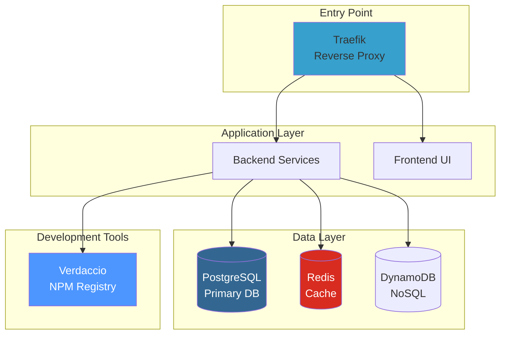

# Infrastructure Components

This directory contains infrastructure and tooling components for the LicenseGuard platform.

---

## Components Overview

| Component | Purpose | Port | Status |
|-----------|---------|------|--------|
| [lg-postgres](./lg-postgres/) | PostgreSQL database | 5432 | ✅ Active |
| [lg-redis](./lg-redis/) | Redis cache & sessions | 6379 | ✅ Active |
| [lg-traefik](./lg-traefik/) | Reverse proxy & load balancer | 80, 443, 8080 | ✅ Active |
| [lg-verdaccio](./lg-verdaccio/) | Local NPM registry | 4873 | ✅ Active |
| [lg-dynamodb](./lg-dynamodb/) | DynamoDB local (testing) | 8000 | ⚠️ Optional |

---

## Architecture



---

## Component Details

### lg-postgres

**What:** PostgreSQL 16 relational database

**Purpose:** Primary data storage for all services

**Configuration:**
- Version: PostgreSQL 16
- Port: 5432 (internal)
- User: `licenseguard`
- Database: `licenseguard`
- Persistence: Docker volume `lg-postgres-data`

**Access:**
```bash
# Connect via psql
docker exec -it lg-infra-postgres psql -U licenseguard -d licenseguard

# Or from host (if port exposed)
psql -h localhost -p 5432 -U licenseguard -d licenseguard
```

**Backup:**
```bash
docker exec lg-infra-postgres pg_dump -U licenseguard licenseguard > backup.sql
```

---

### lg-redis

**What:** Redis 7 in-memory data store

**Purpose:** Caching, session storage, rate limiting

**Configuration:**
- Version: Redis 7
- Port: 6379 (internal)
- Password: Set via `REDIS_PASSWORD` env var
- Persistence: Docker volume `lg-redis-data`

**Access:**
```bash
# Connect via redis-cli
docker exec -it lg-infra-redis redis-cli -a <password>

# Check status
docker exec lg-infra-redis redis-cli -a <password> PING
```

**Common Commands:**
```bash
# View all keys
KEYS *

# Get value
GET some_key

# Clear all data (DANGEROUS!)
FLUSHALL
```

---

### lg-traefik

**What:** Traefik 2.x reverse proxy

**Purpose:** API gateway, SSL termination, load balancing, domain-based routing

**Configuration:**
- Version: Traefik 2.x
- Ports:
  - 80 (HTTP)
  - 443 (HTTPS)
  - 8080 (Dashboard)

**Routing:**
- `admin.lg.local` → lg-admin:3000
- `api.lg.local/user` → user-service:3002
- `api.lg.local/menu` → menu-service:3005
- `api.lg.local/permissions` → permissions-service:3003
- `traefik.lg.local` → Traefik Dashboard

**Dashboard:**
```bash
open http://traefik.lg.local
# Or: http://localhost:8080
```

**Configuration Files:**
- `traefik.yml` - Static configuration
- `dynamic/*.yml` - Dynamic routing rules

---

### lg-verdaccio

**What:** Verdaccio private NPM registry

**Purpose:** Local package registry for development

**Configuration:**
- Version: Verdaccio latest
- Port: 4873
- Storage: Docker volume `lg-verdaccio-data`

**Access:**
```bash
# Web UI
open http://localhost:4873

# Login
npm login --registry http://localhost:4873

# Publish package
npm publish --registry http://localhost:4873
```

**Configure in project:**
```
# .npmrc
@wolfgangm81:registry=http://verdaccio:4873/
```

---

### lg-dynamodb

**What:** DynamoDB Local for testing

**Purpose:** NoSQL database testing (optional)

**Configuration:**
- Version: DynamoDB Local
- Port: 8000
- Use Case: Testing only (not used in production)

**Access:**
```bash
# AWS CLI
aws dynamodb list-tables \
  --endpoint-url http://localhost:8000 \
  --region us-east-1
```

**Status:** ⚠️ Optional - Not required for core platform

---

## Docker Compose Configuration

### Networks

| Network | Type | Purpose |
|---------|------|---------|
| `lg-public` | Bridge | External access (Traefik) |
| `lg-internal` | Bridge | Internal service communication |

### Volumes

| Volume | Purpose | Persistence |
|--------|---------|-------------|
| `lg-postgres-data` | PostgreSQL data | ✅ Persistent |
| `lg-redis-data` | Redis data | ✅ Persistent |
| `lg-verdaccio-data` | NPM packages | ✅ Persistent |
| `lg-traefik-certs` | SSL certificates | ✅ Persistent |

---

## Health Checks

All infrastructure components have health checks:

### PostgreSQL
```bash
docker exec lg-infra-postgres pg_isready -U licenseguard
```

### Redis
```bash
docker exec lg-infra-redis redis-cli -a <password> PING
```

### Traefik
```bash
curl http://localhost:8080/ping
```

### Verdaccio
```bash
curl http://localhost:4873/-/ping
```

---

## Monitoring

### View Logs

```bash
# All infrastructure
docker-compose logs -f postgres redis traefik verdaccio

# Specific component
docker logs -f lg-infra-postgres
docker logs -f lg-infra-redis
docker logs -f lg-infra-traefik
```

### Container Status

```bash
docker-compose ps
```

---

## Backup & Restore

### PostgreSQL

**Backup:**
```bash
# Full database
docker exec lg-infra-postgres pg_dump -U licenseguard licenseguard > backup_$(date +%Y%m%d).sql

# Specific table
docker exec lg-infra-postgres pg_dump -U licenseguard -t users licenseguard > users_backup.sql
```

**Restore:**
```bash
cat backup.sql | docker exec -i lg-infra-postgres psql -U licenseguard -d licenseguard
```

### Redis

**Backup:**
```bash
# Trigger save
docker exec lg-infra-redis redis-cli -a <password> SAVE

# Copy RDB file
docker cp lg-infra-redis:/data/dump.rdb ./redis_backup.rdb
```

**Restore:**
```bash
# Stop Redis
docker-compose stop redis

# Restore RDB file
docker cp ./redis_backup.rdb lg-infra-redis:/data/dump.rdb

# Start Redis
docker-compose start redis
```

---

## Troubleshooting

### PostgreSQL Connection Issues

**Problem:** Services can't connect to database

**Solution:**
```bash
# Check container is running
docker ps | grep postgres

# Check logs
docker logs lg-infra-postgres

# Test connection
docker exec lg-infra-postgres pg_isready -U licenseguard

# Restart
docker-compose restart postgres
```

---

### Redis Connection Issues

**Problem:** Services can't connect to Redis

**Solution:**
```bash
# Check container is running
docker ps | grep redis

# Test connection
docker exec lg-infra-redis redis-cli -a <password> PING

# Check password
echo $REDIS_PASSWORD

# Restart
docker-compose restart redis
```

---

### Traefik Routing Issues

**Problem:** Proxy domains not working

**Solution:**
```bash
# Check /etc/hosts
cat /etc/hosts | grep lg.local

# Add missing entries
sudo sh -c 'echo "127.0.0.1 admin.lg.local api.lg.local traefik.lg.local" >> /etc/hosts'

# Check Traefik dashboard
open http://traefik.lg.local

# View routing config
docker logs lg-infra-traefik | grep -i router
```

---

### Verdaccio Package Issues

**Problem:** Can't publish or install packages

**Solution:**
```bash
# Check container is running
docker ps | grep verdaccio

# Check web UI
open http://localhost:4873

# Login
npm login --registry http://localhost:4873

# Check .npmrc
cat ~/.npmrc | grep verdaccio
```

---

## Security

### PostgreSQL

- ✅ Password authentication required
- ✅ Not exposed to internet (internal network only)
- ⚠️ Default password should be changed in production

### Redis

- ✅ Password authentication required
- ✅ Not exposed to internet (internal network only)
- ⚠️ Default password should be changed in production

### Traefik

- ✅ HTTPS with Let's Encrypt (production)
- ✅ Dashboard password protection (production)
- ⚠️ Dashboard exposed in development (localhost only)

---

## Performance Tuning

### PostgreSQL

```sql
-- View current settings
SHOW ALL;

-- Tune for development (in postgresql.conf)
shared_buffers = 256MB
max_connections = 100
work_mem = 4MB
```

### Redis

```bash
# View memory usage
docker exec lg-infra-redis redis-cli -a <password> INFO memory

# Set max memory
docker exec lg-infra-redis redis-cli -a <password> CONFIG SET maxmemory 256mb
```

---

## Related Documentation

- [System Architecture](../../docs/ARCHITECTURE.md)
- [Docker Setup](../../docs/DOCKER.md)
- [Proxy Domains](../../PROXY_DOMAINS.md)
- [Troubleshooting](../../docs/TROUBLESHOOTING.md)

---

**Total Components:** 5
**Technology Stack:** PostgreSQL, Redis, Traefik, Verdaccio, DynamoDB
**Deployment:** Docker Compose (local), AWS (production - future)
