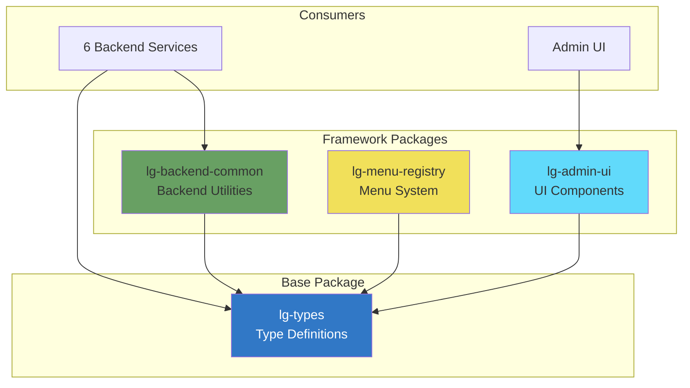

# Shared Packages

This directory contains shared npm packages used across the LicenseGuard platform.

---

## Packages Overview

| Package | Purpose | Dependents | Version |
|---------|---------|------------|---------|
| [lg-types](./lg-types/) | TypeScript type definitions | All (10 projects) | 1.0.0 |
| [lg-backend-common](./lg-backend-common/) | Shared backend utilities | 6 services | 1.0.0 |
| [lg-menu-registry](./lg-menu-registry/) | Menu system configuration | 1 service | 1.0.0 |
| [lg-admin-ui](./lg-admin-ui/) | React UI components | 1 app | 1.0.0 |

---

## Package Architecture



---

## Package Details

### lg-types

**What:** Shared TypeScript type definitions for the entire platform

**Exports:**
- User types (User, UserRole, UserSession)
- Menu types (MenuItem, MenuPermission)
- Permission types (Permission, Role)
- API types (APIKey, APIResponse)
- Secret types (Secret, SecretVersion)

**Usage:**
```typescript
import { User, MenuItem, Permission } from '@wolfgangm81/lg-types';
```

**Impact:** HIGH - Changes affect all projects

---

### lg-backend-common

**What:** Shared backend utilities, middleware, and helpers

**Exports:**
- Authentication middleware (JWT validation)
- Error handling middleware
- Logging utilities (Winston)
- Database helpers (Knex utilities)
- Validation helpers (Joi schemas)

**Usage:**
```typescript
import { authMiddleware, errorHandler } from '@wolfgangm81/lg-backend-common';
```

**Impact:** HIGH - Changes affect all backend services

---

### lg-menu-registry

**What:** Menu system configuration and validation

**Exports:**
- Menu definitions
- Menu item schemas
- Menu validation utilities

**Usage:**
```typescript
import { defaultMenuItems, validateMenu } from '@wolfgangm81/lg-menu-registry';
```

**Impact:** LOW - Only affects menu service

---

### lg-admin-ui

**What:** Shared React UI components

**Exports:**
- Button, Input, Select components
- Table, Modal, Card components
- Theme provider

**Usage:**
```typescript
import { Button, Input, Table } from '@wolfgangm81/lg-admin-ui';
```

**Impact:** LOW - Only affects admin UI

---

## Development Workflow

### Hot-Reload Development

For rapid package development, use the hot-reload system:

```bash
# Enable hot-reload
make dev-sync

# Open live dashboard
make dev-sync-dashboard

# Edit package source
vi repos/packages/lg-menu-registry/src/index.ts

# Changes automatically compiled in ~2-3 seconds
# Dependent services automatically restarted
```

**See:** [HOT_RELOAD_QUICK_REF.md](../../HOT_RELOAD_QUICK_REF.md)

---

### Normal Development (Without Hot-Reload)

```bash
# Navigate to package
cd repos/packages/lg-backend-common

# Make changes
vi src/middleware/auth.ts

# Build
npm run build

# Test
npm test

# Publish to GitHub Packages (via GitHub Actions)
git add .
git commit -m "feat: add new middleware"
git push
```

---

## Publishing

### Automated Publishing (Recommended)

**All packages auto-publish via GitHub Actions when pushed to main:**

```bash
cd repos/packages/lg-backend-common

# Bump version
npm version patch  # or minor, major

# Commit and push
git add .
git commit -m "chore: bump version to 1.0.1"
git push

# GitHub Actions automatically:
# 1. Runs tests
# 2. Builds package
# 3. Publishes to GitHub Packages
```

---

### Manual Publishing (Not Recommended)

```bash
# Build
npm run build

# Login to GitHub Packages
npm login --registry https://npm.pkg.github.com

# Publish
npm publish --registry https://npm.pkg.github.com
```

---

## Version Management

### Semantic Versioning

All packages follow [Semantic Versioning 2.0.0](https://semver.org/):

- **MAJOR** (1.0.0 → 2.0.0): Breaking changes
- **MINOR** (1.0.0 → 1.1.0): New features, backward-compatible
- **PATCH** (1.0.0 → 1.0.1): Bug fixes, backward-compatible

### Version Bumping

```bash
# Bug fix
npm version patch

# New feature
npm version minor

# Breaking change
npm version major
```

---

## Package Structure

All packages follow this structure:

```
lg-*-package/
├── src/                   # TypeScript source code
│   ├── index.ts          # Main entry point
│   ├── types/            # Type definitions (if needed)
│   └── utils/            # Utility functions
├── dist/                  # Compiled JavaScript (gitignored)
│   ├── index.js          # Compiled entry point
│   └── index.d.ts        # Type declarations
├── tests/                 # Unit tests
├── package.json           # Package metadata
├── tsconfig.json         # TypeScript configuration
├── tsconfig.build.json   # Build-specific TS config
├── CLAUDE.md             # AI development guidelines
└── README.md             # Package documentation
```

---

## Testing

### Run Tests

```bash
cd repos/packages/lg-backend-common
npm test
```

### Test Coverage

```bash
npm run test:coverage
```

---

## Dependencies

### Package Dependencies

| Package | Dependencies | Peer Dependencies |
|---------|--------------|-------------------|
| lg-types | None | None |
| lg-backend-common | winston, joi, bcrypt | lg-types, express |
| lg-menu-registry | None | lg-types |
| lg-admin-ui | None | react, react-dom, lg-types |

### Dependency Graph

See [DEPENDENCIES.md](../../docs/DEPENDENCIES.md) for complete dependency graph.

---

## Troubleshooting

### "Package not found" Error

**Problem:** `npm install` fails with 404 error

**Solution:**
1. Check `.npmrc` contains:
   ```
   @wolfgangm81:registry=https://npm.pkg.github.com
   ```

2. Verify GitHub token has `read:packages` scope

3. Login to GitHub Packages:
   ```bash
   npm login --registry https://npm.pkg.github.com
   ```

---

### "Version conflict" Error

**Problem:** Multiple versions of same package installed

**Solution:**
```bash
# Clean install
rm -rf node_modules package-lock.json
npm install

# Or force specific version
npm install @wolfgangm81/lg-types@^1.0.0 --force
```

---

### Hot-Reload Not Working

**Problem:** Changes not reflected in services

**Solution:**
```bash
# Check builder status
make dev-sync-status

# Check for build errors
make dev-sync-check

# View builder logs
make dev-sync-logs PACKAGE=backend-common

# Restart builders
make dev-sync-rebuild
```

---

## Documentation

Each package has:
- **README.md** - User-facing documentation
- **CLAUDE.md** - AI assistant guidelines

---

## Related Documentation

- [System Architecture](../../docs/ARCHITECTURE.md)
- [Package Dependencies](../../docs/DEPENDENCIES.md)
- [Hot-Reload Quick Reference](../../HOT_RELOAD_QUICK_REF.md)
- [Docker Setup](../../docs/DOCKER.md)

---

**Total Packages:** 4
**Technology Stack:** TypeScript, Node.js, React
**Registry:** GitHub Packages
**Versioning:** Semantic Versioning 2.0.0
