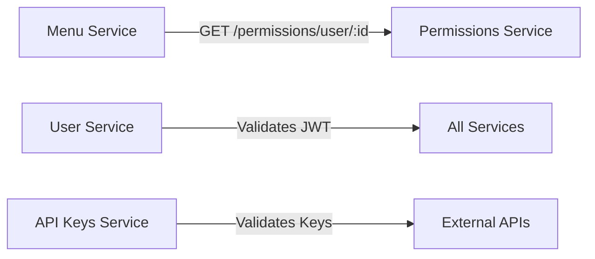

# Backend Services

This directory contains all backend microservices for the LicenseGuard platform.

---

## Services Overview

| Service | Purpose | Port | Status |
|---------|---------|------|--------|
| [lg-user-service](./lg-user-service/) | User management & authentication | 3002 | ✅ Active |
| [lg-menu-service](./lg-menu-service/) | Hierarchical menu management | 3005 | ✅ Active |
| [lg-permissions-service](./lg-permissions-service/) | RBAC & DAG permissions | 3003 | ✅ Active |
| [lg-api-keys-service](./lg-api-keys-service/) | Public API key validation | 3001 | ✅ Active |
| [lg-secrets-service](./lg-secrets-service/) | Encrypted secrets storage | 3007 | ✅ Active |
| [lg-tour-service](./lg-tour-service/) | NextStepjs integration | 3004 | ✅ Active |

---

## Architecture

All services follow a consistent architecture pattern:

```
lg-*-service/
├── src/
│   ├── server.ts          # Entry point
│   ├── app.ts             # Express app configuration
│   ├── routes/            # API route handlers
│   ├── controllers/       # Business logic
│   ├── models/            # Data models
│   ├── middleware/        # Custom middleware
│   └── database/          # Database connection & migrations
├── tests/                 # Unit & integration tests
├── Dockerfile             # Container build
├── package.json           # Dependencies
├── ARCHITECTURE.md        # Detailed architecture docs
├── CLAUDE.md             # AI development guidelines
└── README.md             # Service documentation
```

---

## Common Dependencies

All services use:
- **lg-backend-common** - Shared utilities and middleware
- **lg-types** - TypeScript type definitions
- **Express** - Web framework
- **Knex.js** - SQL query builder
- **PostgreSQL** - Primary database
- **Winston** - Logging

---

## Access URLs

### Development (Local)

| Service | URL | Example Endpoint |
|---------|-----|------------------|
| User Service | `http://api.lg.local/user` | `/user/health` |
| Menu Service | `http://api.lg.local/menu` | `/menu/health` |
| Permissions Service | `http://api.lg.local/permissions` | `/permissions/health` |
| API Keys Service | `http://api.lg.local/v1` | `/v1/health` |
| Secrets Service | `http://api.lg.local/secrets` | `/secrets/health` |
| Tour Service | `http://api.lg.local/tour` | `/tour/health` |

**Note:** Requires `/etc/hosts` configuration. See [PROXY_DOMAINS.md](../../PROXY_DOMAINS.md)

---

## Development Workflow

### Start All Services

```bash
cd /Users/wolfgang/Projects/lg-development
./scripts/dev/start.sh
```

### Work on Specific Service

```bash
# Navigate to service
cd repos/services/lg-user-service

# Make code changes
vi src/routes/auth.ts

# Rebuild and restart (from project root)
cd /Users/wolfgang/Projects/lg-development
docker-compose up -d --build user-service

# View logs
docker logs -f lg-backend-user

# Test changes
curl http://api.lg.local/user/health
```

### Run Tests

```bash
cd repos/services/lg-user-service
npm test
```

---

## Service Communication

Services communicate via HTTP/REST APIs:



---

## Database Schema

All services share a single PostgreSQL database with schema isolation:

- **users** table - User Service
- **menu_items** table - Menu Service
- **permissions**, **roles** tables - Permissions Service
- **api_keys** table - API Keys Service
- **secrets** table - Secrets Service
- **tours** table - Tour Service

See individual service `ARCHITECTURE.md` files for detailed schema documentation.

---

## Monitoring

### Health Checks

All services expose:
- `GET /<service-prefix>/health` - Returns `{ status: "healthy" }` if operational

### Logs

```bash
# View all service logs
docker-compose logs -f

# View specific service
docker logs -f lg-backend-user
docker logs -f lg-backend-menu
```

---

## Documentation

Each service has comprehensive documentation:

- **ARCHITECTURE.md** - Technical architecture, API endpoints, database schema, communication diagrams
- **CLAUDE.md** - AI assistant guidelines for development and documentation maintenance
- **README.md** - User-facing documentation and usage examples

---

## Related Documentation

- [System Architecture](../../docs/ARCHITECTURE.md)
- [Package Dependencies](../../docs/DEPENDENCIES.md)
- [Docker Setup](../../docs/DOCKER.md)
- [RBAC Implementation](../../docs/RBAC.md)

---

**Total Services:** 6
**Technology Stack:** Node.js, Express, TypeScript, PostgreSQL
**Deployment:** Docker Compose (local), Kubernetes (production - future)
